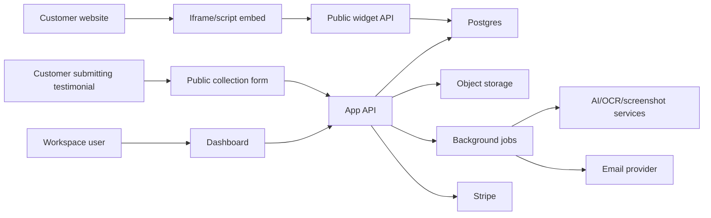

# Testimonial Aggregator App: Product and Implementation Blueprint

Source: `/Users/destiny/Downloads/Testimonial_Aggregator_Research_and_Strategy.pdf`

Created: 2026-06-19

Working name: Testimonial Aggregator. Replace this once the brand name is chosen.

## 1. Product Direction

The app should not try to win by having every possible testimonial feature on day one. The market already has strong tools for collection, imports, widgets, walls of love, analytics, and video. The sharper opportunity is to become the most beautiful and easiest testimonial presentation platform for creators, SaaS founders, agencies, course sellers, and small teams.

The product promise:

> Collect, approve, design, and publish premium testimonial widgets that look native to your brand in minutes.

The core positioning:

- Primary competition: Senja, Testimonial.to, Famewall, Shapo, Trustmary, Boast.
- Baseline features customers expect: collection forms, text testimonials, video testimonials, moderation, embeddable widgets, hosted wall pages, branding controls, imports, analytics, teams, and billing.
- Differentiator: a visual widget studio, beautiful presets, motion-first embeds, live website preview, AI brand matching, and premium wall pages.

The first version should feel more polished than competitors even if it has fewer total features.

## 2. Market Notes

Current competitor sites checked on 2026-06-19:

- Senja positions around importing from 30+ platforms, collecting text and video testimonials, managing/analyzing them, and sharing through widgets or Walls of Love: https://senja.io/
- Testimonial.to includes branded collection pages, smart inbox, Wall of Love embeds, video analytics, social imports, brand monitoring, case studies, NPS, and email follow-ups: https://testimonial.to/
- Famewall focuses on collecting text, video, and audio testimonials with a simple link, then displaying them as widgets or a wall page: https://famewall.io/
- Shapo offers text/video collection, many widget types, review imports, unlimited forms/widgets on paid plans, and HTML embeds for common website builders: https://shapo.io/
- Trustmary is broader feedback software: surveys, review collection, analysis, showcase widgets, and AI-search visibility positioning: https://trustmary.com/
- Boast is strong around video testimonial collection, reminders, hosted/mobile forms, approvals, embeds, video hosting, and distribution: https://boast.io/

Takeaway: collection is table stakes. Presentation quality is the opening.

## 3. Ideal Customers

Start with customers who care about how testimonials look:

- SaaS founders who need social proof on landing pages.
- Agencies that want testimonial widgets for multiple clients.
- Course creators and coaches selling from personal-brand sites.
- Indie hackers and productized service founders.
- Webflow, Framer, WordPress, and Shopify builders who want no-code embeds.

Avoid enterprise review management in the first version. Enterprise buyers need procurement, permissions, audit logs, SSO, advanced compliance, and migration support. That slows down the build before the core product is proven.

## 4. Main User Jobs

Users come to the product to complete these jobs:

- "I need a clean link where customers can submit a testimonial."
- "I want to approve only the best testimonials before publishing."
- "I want a widget that matches my website."
- "I want to paste one embed code into my site."
- "I want a public Wall of Love that looks premium."
- "I want to import existing praise from screenshots, social posts, or CSV."
- "I want to know whether people are seeing and clicking my social proof."

The app should reduce friction across this path:

1. Create workspace.
2. Create collection form.
3. Collect/import testimonial.
4. Approve testimonial.
5. Design widget.
6. Preview widget on a site.
7. Copy embed code.
8. Track views and clicks.

## 5. Product Principles

- Design is the product. Widgets and walls must look better than what users can build by hand.
- Start narrow. Build text testimonials first, then video, then imports and AI.
- Keep collection simple. The customer submitting a testimonial should not need an account.
- Make publishing safe. Unapproved testimonials should never appear in embeds.
- Make embeds stable. Customer websites should not break when your app deploys.
- Prefer presets over infinite controls. Users need beautiful defaults plus enough control.
- Make performance visible. Widgets must be lightweight and fast.
- Treat testimonials as sensitive user-generated content. Consent, deletion, and moderation matter.

## 6. Product Modules

### 6.1 Authentication and Workspaces

Purpose:

Give every user a secure account and one or more workspaces.

MVP features:

- Email/password or magic-link login.
- Workspace creation during onboarding.
- Workspace slug for public pages.
- Workspace settings: name, logo, website URL, default brand colors.
- Owner role only.

Later features:

- Team invites.
- Roles: owner, admin, editor, viewer.
- Workspace transfer.
- Audit log.
- SSO for enterprise.

Implementation:

- Recommended stack: Next.js, TypeScript, Postgres, Drizzle ORM, Supabase Auth or Clerk, Stripe, object storage, and Vercel.
- If using Supabase, enable Row Level Security on exposed tables and never expose service-role keys in browser code.
- Store workspace membership separately from auth users.
- Every main table should include `workspace_id`.

### 6.2 Onboarding

Purpose:

Get a user to first published widget as fast as possible.

MVP flow:

1. Ask for workspace name.
2. Ask for website URL.
3. Generate initial brand colors from URL manually or with simple metadata extraction.
4. Create default collection form.
5. Create default widget.
6. Show "Collect testimonials" and "Copy embed" actions.

Later flow:

- AI Brand Matcher scans the user's website and generates theme options.
- Live website preview shows the widget on a screenshot of the user's site.
- Import wizard offers CSV, screenshot, X, LinkedIn, Google, G2, Product Hunt, and manual paste.

Implementation:

- Keep onboarding state in `workspace_onboarding`.
- Let users skip every step.
- Create seed data: one form, one widget, one wall page, and sample testimonial.
- Remove sample testimonial from public embeds unless user explicitly enables it.

### 6.3 Testimonial Collection Forms

Purpose:

Let users collect testimonials from customers through a public link.

MVP features:

- Public form URL: `/submit/{workspace_slug}/{form_slug}`.
- Text testimonial submission.
- Customer name, role/title, company, website, avatar URL.
- Rating field, optional.
- Consent checkbox.
- Optional photo/avatar upload.
- Custom thank-you message.
- Basic spam protection.

Should support later:

- Video upload or recording.
- Audio upload.
- Question prompts.
- Multiple-step forms.
- Custom fields.
- Hidden fields in URL, for example `?source=launch-email&customer_id=123`.
- Incentive/reward note.
- Redirect after submit.
- Language/localization.

Implementation:

- Public form should write to `testimonials` with status `pending`.
- Validate file type and file size on upload.
- Use signed upload URLs for media.
- Store consent timestamp, IP hash, and user agent for abuse/debugging.
- Add rate limits by IP, workspace, and form.
- Honeypot field plus Turnstile or reCAPTCHA if spam appears.

### 6.4 Testimonial Inbox and Moderation

Purpose:

Give users control before anything goes public.

MVP features:

- Inbox table with pending, approved, rejected, archived statuses.
- Approve, reject, archive.
- Edit text, customer name, role, company, avatar.
- Tag testimonials.
- Search and filter by status, tag, rating, source, media type.
- Detail page for each testimonial.

Later features:

- Bulk actions.
- AI cleanup: fix grammar without changing meaning.
- AI summary and sentiment.
- Duplicate detection.
- Internal notes.
- "Ask for permission" email if imported testimonial lacks consent.
- Report/flag system for published widgets.

Implementation:

- Never publish `pending` content.
- Keep original submitted text in `original_content`.
- Keep edited display text in `display_content`.
- Track moderation events in `testimonial_events`.
- Support soft delete with `deleted_at`.

### 6.5 Testimonial Library

Purpose:

Make testimonials reusable across widgets, walls, pages, and campaigns.

MVP features:

- Approved testimonial library.
- Tags and source labels.
- Star rating.
- Featured toggle.
- Basic customer profile fields.
- Media preview.

Later features:

- Customer profile pages.
- Case study conversion.
- Testimonial collections/folders.
- AI topic clustering.
- Performance score based on widget engagement.
- Translation/localization.

Implementation:

- Treat `testimonials` as the source of truth.
- Use join tables for tags and widget selections.
- Avoid duplicating testimonials into widgets. Widgets should reference testimonial IDs.

### 6.6 Visual Widget Studio

Purpose:

This is the main differentiator. Users design testimonial widgets visually.

MVP widget types:

- Single card.
- Grid.
- Carousel.
- Masonry wall.
- Marquee.
- Floating toast.

MVP design controls:

- Layout type.
- Theme preset.
- Light/dark mode.
- Accent color.
- Card radius.
- Card border.
- Shadow intensity.
- Background color or transparent.
- Font family choice.
- Testimonial count.
- Show/hide avatar.
- Show/hide company.
- Show/hide rating.
- Show/hide source badge.
- Motion on/off.

Premium controls:

- Custom CSS variables.
- Spacing scale.
- Card density.
- Avatar shape.
- Star style.
- Animation style.
- Mobile layout override.
- CTA button.
- Filter by tag.
- Randomize order.
- Pinned testimonials.

Differentiated controls:

- AI Brand Matcher.
- Live Website Preview.
- Motion presets.
- "Looks like Apple/Stripe/Linear/Notion/Vercel/Framer" design presets.
- Save theme as reusable brand kit.
- Community theme marketplace.

Implementation:

- Store each widget in `widgets`.
- Store design settings as versioned JSON in `widgets.config`.
- Validate widget config with Zod before saving.
- Build a shared `WidgetRenderer` package used by dashboard preview and public embed.
- Keep render output deterministic so dashboard preview matches embedded widget.
- Use CSS variables for themes.
- Use Framer Motion or CSS animations carefully in dashboard, but keep public embeds light.
- Public widget runtime should respect `prefers-reduced-motion`.

Example widget config:

```json
{
  "version": 1,
  "type": "carousel",
  "theme": "linear-dark",
  "layout": {
    "columns": 3,
    "gap": 16,
    "maxItems": 12
  },
  "style": {
    "accent": "#5B7CFA",
    "background": "transparent",
    "cardBackground": "#101114",
    "textColor": "#F4F4F5",
    "radius": 14,
    "shadow": "soft",
    "fontFamily": "Inter"
  },
  "display": {
    "showAvatar": true,
    "showCompany": true,
    "showRating": true,
    "showSource": true
  },
  "motion": {
    "enabled": true,
    "preset": "subtle-slide"
  }
}
```

Future content-format modes (deferred):

The Studio is built to host more than embeddable widgets and Walls of Love. The
formats below were removed from the shipped Studio UI on `2026-06-30` because they
had no working editor behind them — the Studio only surfaces creation modes that
produce a real, previewable, shareable asset. Bring each back as its own mode once
it has a live editor and renderer, not as an empty gallery. Target window: Phase 5
(Differentiators) and Phase 6 (Growth and Integrations).

- **Sizzle Reels** — stitch multiple video testimonials into one shareable highlight reel (intro, ordered clips, outro, captions). Needs a timeline/montage editor and video processing.
- **Social Videos** — animated, shareable videos generated from a single text or video testimonial, sized per platform (square / story / landscape). Needs motion templates and a render pipeline.
- **Popups** — on-site testimonial toast or modal that appears by trigger/targeting rules. Needs a lightweight runtime plus display-rule controls (position, delay, frequency, pages).
- **Video Embeds** — embed one or several video testimonials directly on a site (single player or playlist). Needs the public video runtime and a poster/thumbnail flow.
- **Images** — static quote images generated from a testimonial for social posts and emails (per-format templates, export to PNG). Needs an image-composition/export step.

All five should reuse the existing seams: store the asset in `widgets` with a
`kind`/format discriminator and versioned JSON in `config`, render through a shared
deterministic renderer (mirroring `WidgetRenderer`), and publish via the same
`/embed` + share-link surfaces. See the live Widget Studio (`StudioEditor.jsx`) and
Walls editor as the preview-first pattern to follow.

### 6.7 Embeddable Widget Runtime

Purpose:

Let users publish testimonials anywhere with one embed code.

MVP embed:

```html
<script async src="https://yourdomain.com/embed.js" data-widget-id="WIDGET_ID"></script>
```

Alternative MVP for speed:

```html
<iframe src="https://yourdomain.com/embed/WIDGET_ID" width="100%" style="border:0;"></iframe>
```

Recommendation:

- Start with iframe embeds for reliability across no-code platforms.
- Add script/shadow DOM embeds later for better native integration and auto-height behavior.

MVP runtime features:

- Fetch approved testimonials for widget.
- Render widget with selected design config.
- Auto-height iframe using postMessage.
- Track view events.
- Track click events.
- Graceful empty state.
- Cache public widget payload.

Later runtime features:

- Shadow DOM script embed.
- React/Next.js package.
- Web component: `<testimonial-widget widget-id="..."></testimonial-widget>`.
- Shopify app block.
- WordPress plugin.
- Framer component.
- Webflow copy snippet.

Implementation:

- Public route: `/embed/{widget_id}` renders iframe page.
- Public API: `/api/public/widgets/{widget_id}` returns sanitized widget payload.
- Events endpoint: `/api/public/events`.
- Use `navigator.sendBeacon` for analytics when possible.
- Do not expose private fields, email addresses, IPs, internal notes, or unapproved content.
- Add allowed origins per workspace to prevent abuse.
- Cache widget payload at the edge for 60 to 300 seconds.

### 6.8 Wall of Love Pages

Purpose:

Give users a hosted public page for all approved testimonials.

MVP features:

- Public URL: `/{workspace_slug}/love` or `/w/{wall_slug}`.
- Masonry layout.
- Hero title and description.
- Workspace logo.
- Approved testimonials only.
- CTA button.
- Basic SEO metadata.

Premium features:

- Custom domain.
- Multiple walls per workspace.
- Animated wall themes.
- Filters by tag/source.
- Featured section.
- Video wall.
- Case study cards.
- Newsletter/social share image generation.

Implementation:

- Store wall pages in `walls`.
- Store wall config as JSON.
- Use the same renderer concepts as widgets.
- Generate server-rendered metadata.
- Consider static/edge cache for public wall routes.

### 6.9 Live Website Preview

Purpose:

Let users see the widget on their own website before embedding.

MVP version:

- User enters website URL.
- App loads screenshot image or static preview frame.
- User selects widget position: above fold, section, bottom, floating.
- App overlays widget preview on top of screenshot.

Later version:

- Browser captures full-page screenshot.
- User clicks where widget should appear.
- Preview supports desktop/mobile widths.
- App recommends best widget type based on page layout.

Implementation:

- Do not try to proxy and execute arbitrary customer websites inside your app for MVP.
- Use a screenshot service or Playwright worker to capture a screenshot.
- Store preview screenshots temporarily.
- Overlay widget in dashboard only.
- This is not the actual embed. It is a planning tool.

### 6.10 AI Brand Matcher

Purpose:

Generate widget styles that match a customer's website.

MVP version:

- User enters website URL.
- Fetch page metadata and screenshot.
- Extract dominant colors, background colors, font clues, border radius, and visual density.
- Generate 3 theme suggestions.
- User applies one to widget.

Later version:

- Use a vision-capable model to analyze screenshot aesthetics.
- Generate CSS variables.
- Explain why each theme matches the site.
- Save as workspace brand kit.

Implementation:

- Start with deterministic extraction:
  - screenshot dominant colors
  - page title/logo
  - CSS font-family hints
  - light/dark detection
  - average background color
- Only add AI after the manual/deterministic version works.
- Store outputs in `brand_kits`.
- Keep AI prompts versioned in code.
- Let the user edit everything AI generates.

### 6.11 Imports

Purpose:

Bring existing social proof into the product.

MVP import options:

- Manual add testimonial.
- CSV import.
- Paste text.
- Upload screenshot and manually crop/confirm.

Next import options:

- Screenshot OCR for WhatsApp, email, DMs, X posts, LinkedIn posts.
- Import from public URLs where allowed.
- Browser extension or bookmarklet.
- Zapier/webhook ingestion.

Later import options:

- Google Reviews.
- G2.
- Product Hunt.
- App Store/Play Store.
- Shopify reviews.
- Trustpilot.
- Reddit/X/LinkedIn monitoring.

Implementation:

- Create `imports` table with status: queued, processing, needs_review, imported, failed.
- Never publish imported content automatically.
- Imported testimonials should default to `pending` and `consent_status = unknown`.
- For screenshots, extract possible testimonial text, person name, platform, and date, then ask user to confirm.
- Keep source URL, screenshot, or import evidence for user reference.
- Respect platform terms and avoid scraping authenticated/private content without user authorization.

### 6.12 AI Features

Useful AI features:

- Brand Matcher.
- Screenshot testimonial extraction.
- Grammar cleanup.
- Shorter/longer testimonial variants.
- Testimonial tags and topic clustering.
- Sentiment analysis.
- "Best testimonial for this landing page" recommendation.
- Case study draft from testimonial and questions.
- Social post image/caption generator.

MVP AI scope:

- Do not add AI to the first week unless it is already easy in your stack.
- Add AI Brand Matcher and screenshot extraction after the widget studio is stable.

Implementation:

- Use an `ai_jobs` table for asynchronous AI tasks.
- Store prompt version, input hash, output, status, model/provider, token/cost metadata, and error.
- Do not overwrite user content silently.
- Show AI output as suggestions.
- Add user confirmation before saving AI-edited testimonials.

### 6.13 Analytics

Purpose:

Show users whether testimonials are being seen and clicked.

MVP metrics:

- Widget views.
- Wall page views.
- CTA clicks.
- Testimonial card clicks.
- Video plays.
- Top widgets.
- Top testimonials.

Later metrics:

- Conversion tracking snippet.
- A/B test widget themes.
- UTM/source breakdown.
- Referrer domains.
- Time-series charts.
- Per-page performance.

Implementation:

- Events endpoint receives anonymous public events.
- Events table should be append-only.
- De-dupe noisy events by session, widget, event type, and time window.
- Use IP hashing and do not store raw IP unless legally necessary.
- Aggregate into daily stats table with a scheduled job.

### 6.14 Billing and Plans

Purpose:

Monetize without blocking early adoption.

Suggested plans:

- Free: 1 workspace, 1 wall, 2 widgets, 15 testimonials, branding included.
- Starter: more testimonials, remove branding, more widgets, basic analytics.
- Pro: AI Brand Matcher, screenshot imports, custom domains, advanced themes, video.
- Agency: multiple workspaces, client management, team members, white label.
- Enterprise later: SSO, audit logs, contracts, priority support.

Feature gates:

- Testimonial count.
- Widget count.
- Wall count.
- Remove branding.
- Custom domains.
- Video storage minutes.
- AI credits.
- Team seats.
- Import sources.

Implementation:

- Use Stripe Checkout and customer portal.
- Store subscription state in `subscriptions`.
- Keep plan limits in code and database.
- Use webhooks to sync billing status.
- Always enforce limits on the server, not only in the UI.

### 6.15 Notifications

MVP notifications:

- New testimonial submitted.
- Testimonial import finished.
- Widget copied/published milestone.
- Billing/payment issue.

Later notifications:

- Weekly analytics digest.
- "You have 5 pending testimonials."
- Slack integration.
- Webhooks.
- Customer thank-you emails.
- Automated testimonial request campaign.

Implementation:

- Use transactional email provider.
- Keep `notifications` table for in-app notices.
- Use `email_events` table for delivery/debug.
- Add workspace-level notification settings.

### 6.16 Team and Agency Features

Do not build first unless target customers are agencies from day one.

Agency features:

- Multiple client workspaces.
- Role-based access.
- White label embeds.
- Client handoff.
- Agency dashboard.
- Shared theme library.
- Template duplication.

Implementation:

- Your workspace model should support this later.
- Membership table should include role.
- Billing account can own multiple workspaces.

### 6.17 Admin and Operations

Internal admin features:

- User lookup.
- Workspace lookup.
- Subscription status.
- Testimonial count.
- Media usage.
- AI usage.
- Job failures.
- Abuse reports.
- Manual refund/support notes.

Implementation:

- Keep admin routes separate and protected.
- Log sensitive admin actions.
- Never expose service credentials in admin UI.

## 7. Recommended MVP Scope

Build this first:

- Authentication.
- Workspace onboarding.
- Public text testimonial form.
- Dashboard inbox.
- Approve/reject/edit testimonials.
- Tags.
- Basic widget studio.
- Iframe embed.
- Copy embed code.
- Public Wall of Love.
- Basic analytics.
- Stripe billing.
- Landing page.

Do not build this first:

- Marketplace.
- Browser extension.
- Full social imports.
- Advanced AI.
- Enterprise permissions.
- Mobile app.
- Deep video editing.
- Complex automation sequences.

## 8. Suggested Technical Stack

Fast solo-founder stack:

- App: Next.js with App Router, React, TypeScript.
- Styling: Tailwind CSS plus a small design system.
- Animation: Framer Motion in dashboard; CSS-only or minimal JS in public embeds.
- Database: Postgres.
- ORM: Drizzle ORM or Prisma. Drizzle is lighter and maps well to SQL.
- Auth: Supabase Auth, Clerk, or Better Auth. Pick one and keep it simple.
- Storage: Cloudflare R2, Supabase Storage, S3, or Mux/Cloudflare Stream for serious video.
- Payments: Stripe Checkout, billing portal, and webhooks.
- Background jobs: Inngest, Trigger.dev, BullMQ, or a simple queue table first.
- Email: Resend, Postmark, or Loops for product emails.
- Analytics charts: Recharts, Tremor, or simple custom charts.
- Hosting: Vercel for app, separate worker if heavy screenshot/video jobs grow.

Recommended path:

- Start with Next.js, Postgres, Drizzle, Supabase Auth, Stripe, R2 or Supabase Storage, and Resend.
- Add Mux or Cloudflare Stream only when video collection becomes important.
- Add a job runner when imports, screenshots, AI, and emails need reliability.

## 9. High-Level Architecture



## 10. Data Model

Core tables:

### users

- `id`
- `email`
- `name`
- `avatar_url`
- `created_at`
- `updated_at`

### workspaces

- `id`
- `name`
- `slug`
- `website_url`
- `logo_url`
- `brand_color`
- `plan`
- `created_at`
- `updated_at`

### workspace_members

- `id`
- `workspace_id`
- `user_id`
- `role` - owner, admin, editor, viewer
- `created_at`

### collection_forms

- `id`
- `workspace_id`
- `name`
- `slug`
- `status` - active, paused, archived
- `config` - JSON
- `created_at`
- `updated_at`

### testimonials

- `id`
- `workspace_id`
- `form_id`
- `status` - pending, approved, rejected, archived
- `media_type` - text, video, audio, image
- `original_content`
- `display_content`
- `rating`
- `customer_name`
- `customer_role`
- `customer_company`
- `customer_website`
- `customer_avatar_url`
- `source_type` - form, manual, csv, screenshot, x, linkedin, google, g2, api
- `source_url`
- `source_label`
- `consent_status` - granted, unknown, revoked
- `consent_text`
- `consent_granted_at`
- `metadata` - JSON
- `created_at`
- `updated_at`
- `deleted_at`

### media_assets

- `id`
- `workspace_id`
- `testimonial_id`
- `type` - avatar, video, audio, screenshot, image
- `storage_key`
- `public_url`
- `mime_type`
- `size_bytes`
- `duration_seconds`
- `width`
- `height`
- `status` - uploaded, processing, ready, failed
- `created_at`

### tags

- `id`
- `workspace_id`
- `name`
- `color`
- `created_at`

### testimonial_tags

- `testimonial_id`
- `tag_id`

### widgets

- `id`
- `workspace_id`
- `name`
- `slug`
- `type` - single, grid, carousel, masonry, marquee, toast
- `status` - draft, published, archived
- `config` - JSON
- `selection_mode` - manual, tag, newest, featured
- `created_at`
- `updated_at`

### widget_testimonials

- `widget_id`
- `testimonial_id`
- `position`

### walls

- `id`
- `workspace_id`
- `name`
- `slug`
- `status`
- `config` - JSON
- `created_at`
- `updated_at`

### brand_kits

- `id`
- `workspace_id`
- `name`
- `website_url`
- `logo_url`
- `colors` - JSON
- `fonts` - JSON
- `theme_config` - JSON
- `created_at`

### imports

- `id`
- `workspace_id`
- `type` - csv, screenshot, url, api
- `status` - queued, processing, needs_review, imported, failed
- `source`
- `input_asset_id`
- `result` - JSON
- `error`
- `created_at`
- `updated_at`

### analytics_events

- `id`
- `workspace_id`
- `widget_id`
- `wall_id`
- `testimonial_id`
- `event_type` - widget_view, wall_view, cta_click, card_click, video_play
- `session_id`
- `referrer`
- `origin`
- `metadata` - JSON
- `created_at`

### analytics_daily

- `id`
- `workspace_id`
- `widget_id`
- `wall_id`
- `date`
- `views`
- `clicks`
- `video_plays`

### subscriptions

- `id`
- `workspace_id`
- `stripe_customer_id`
- `stripe_subscription_id`
- `plan`
- `status`
- `current_period_end`
- `created_at`
- `updated_at`

### ai_jobs

- `id`
- `workspace_id`
- `type`
- `status`
- `input` - JSON
- `output` - JSON
- `prompt_version`
- `provider`
- `model`
- `cost_cents`
- `error`
- `created_at`
- `updated_at`

## 11. API Routes

Use this as a starting route map.

Dashboard routes:

- `GET /dashboard`
- `GET /dashboard/testimonials`
- `GET /dashboard/testimonials/{id}`
- `GET /dashboard/widgets`
- `GET /dashboard/widgets/{id}`
- `GET /dashboard/walls`
- `GET /dashboard/forms`
- `GET /dashboard/imports`
- `GET /dashboard/analytics`
- `GET /dashboard/settings`
- `GET /dashboard/billing`

Public routes:

- `GET /submit/{workspace_slug}/{form_slug}`
- `POST /api/public/forms/{form_id}/submissions`
- `GET /embed/{widget_id}`
- `GET /api/public/widgets/{widget_id}`
- `POST /api/public/events`
- `GET /w/{wall_slug}`

Authenticated API routes:

- `POST /api/workspaces`
- `PATCH /api/workspaces/{id}`
- `POST /api/forms`
- `PATCH /api/forms/{id}`
- `POST /api/testimonials`
- `PATCH /api/testimonials/{id}`
- `POST /api/testimonials/{id}/approve`
- `POST /api/testimonials/{id}/reject`
- `POST /api/widgets`
- `PATCH /api/widgets/{id}`
- `POST /api/widgets/{id}/publish`
- `POST /api/imports`
- `POST /api/brand-matcher`
- `POST /api/billing/checkout`
- `POST /api/billing/portal`
- `POST /api/webhooks/stripe`

## 12. Permissions

Workspace roles:

- Owner: everything, billing, delete workspace.
- Admin: manage content, widgets, walls, forms, team, settings.
- Editor: manage testimonials, widgets, walls, imports.
- Viewer: read-only analytics and content.

MVP:

- Only owner.

Implementation:

- Create a server helper: `requireWorkspaceRole(workspaceId, minimumRole)`.
- Never trust workspace IDs from client without checking membership.
- Public routes should only access published/sanitized data.

## 13. Widget Rendering Rules

Public widgets must:

- Only show approved testimonials.
- Never show emails or private metadata.
- Load quickly.
- Avoid layout shift.
- Be responsive.
- Support reduced motion.
- Work inside iframes.
- Handle empty state gracefully.
- Not leak unpublished config.

Performance budget:

- Initial embed JS under 30 KB compressed if using script embed.
- Public widget API response under 100 KB for normal widgets.
- Lazy-load video thumbnails and players.
- Cache public widget data.

## 14. Security, Privacy, and Compliance

MVP security checklist:

- Server-side auth checks on every dashboard action.
- Workspace isolation in all queries.
- RLS if using Supabase-exposed public schema.
- Rate limit public forms and public events.
- Sanitize testimonial text before rendering.
- Validate widget config.
- Validate upload type and size.
- Use signed upload URLs.
- Hide private data from embed payload.
- Store consent state.
- Let users delete testimonials.
- Let submitters request deletion via support/manual process initially.

Privacy considerations:

- Testimonials may include names, job titles, photos, videos, company names, and opinions.
- Add a consent checkbox on public forms.
- Let workspace owner edit or unpublish content.
- Add terms/privacy links to public collection form.
- For imported testimonials, mark consent as unknown until confirmed.

## 15. UX Pages to Design

Dashboard:

- Home overview.
- Testimonial inbox.
- Testimonial detail drawer/page.
- Add testimonial manually.
- Collection forms list.
- Form builder.
- Widget list.
- Widget studio.
- Embed instructions modal.
- Wall page builder.
- Imports page.
- Analytics page.
- Settings page.
- Billing page.

Public:

- Collection form.
- Thank-you page.
- Embed iframe page.
- Wall of Love page.
- Landing page.
- Pricing page.
- Login/signup.

## 16. Widget Preset Library

Build presets early. They are part of the product value.

Starter presets:

- Minimal Light.
- Minimal Dark.
- Linear Dark.
- Stripe Clean.
- Apple Glass.
- Notion Editorial.
- Vercel Mono.
- Framer Motion.
- Warm Creator.
- SaaS Blue.

Each preset should define:

- Typography.
- Card radius.
- Background.
- Border.
- Shadow.
- Accent color.
- Star style.
- Avatar treatment.
- Motion preset.

## 17. Implementation Phases

### Phase 0: Project Setup

Goal: create a stable foundation.

Tasks:

- Create Next.js app.
- Add TypeScript strict mode.
- Add Tailwind.
- Add database.
- Add ORM and migrations.
- Add auth.
- Add base layout.
- Add dashboard shell.
- Add environment variable validation.
- Add basic design tokens.
- Add error logging.

Exit criteria:

- User can sign up and see an empty dashboard.
- Database migrations run.
- App deploys.

### Phase 1: Collection and Moderation

Goal: collect first real testimonial.

Tasks:

- Workspace onboarding.
- Public collection form.
- Testimonial submission API.
- Inbox list.
- Approve/reject/edit.
- Manual testimonial creation.
- Tags.
- Basic search/filter.

Exit criteria:

- A customer can submit testimonial without logging in.
- Workspace owner can approve it.
- Approved testimonial is available for widgets.

### Phase 2: Widget Studio and Embeds

Goal: publish a beautiful widget.

Tasks:

- Widget model.
- Widget studio UI.
- Preset themes.
- Widget preview.
- Iframe embed route.
- Copy embed code.
- Public widget API.
- Public widget renderer.
- Auto-height postMessage.

Exit criteria:

- User can create a widget, pick a preset, preview it, and embed it on an external HTML page.

### Phase 3: Wall of Love and Analytics

Goal: give users a full public showcase and basic performance data.

Tasks:

- Wall page model.
- Public wall route.
- Wall design settings.
- Widget/wall view events.
- CTA click tracking.
- Analytics dashboard.
- Daily aggregation job.

Exit criteria:

- User can share hosted wall URL.
- User can see views and clicks.

### Phase 4: Billing and Launch

Goal: charge for the product.

Tasks:

- Stripe customer creation.
- Checkout route.
- Billing portal route.
- Stripe webhook handler.
- Plan limits.
- Pricing page.
- Upgrade prompts.
- Remove branding gate.

Exit criteria:

- User can upgrade.
- App enforces plan limits.
- Billing state syncs from Stripe.

### Phase 5: Differentiators

Goal: make the product clearly special.

Tasks:

- Live website preview.
- Brand kit.
- AI Brand Matcher.
- Screenshot testimonial import.
- More motion presets.
- Better wall themes.
- Case study cards.

Exit criteria:

- User can paste website URL and get matching widget themes.
- User can upload screenshot and turn it into pending testimonial.

### Phase 6: Growth and Integrations

Goal: expand acquisition and retention.

Tasks:

- Webhooks.
- Zapier/Make integration.
- React package.
- Framer/Webflow instructions.
- WordPress plugin.
- Import sources.
- Weekly digest emails.
- Agency workspaces.

Exit criteria:

- Product can support users with multiple sites and repeated workflows.

## 18. First 30-Day Build Plan

Week 1:

- App setup.
- Auth.
- Workspace onboarding.
- Database schema.
- Collection form.
- Submit text testimonial.

Week 2:

- Dashboard inbox.
- Approve/reject/edit.
- Tags.
- Manual add.
- Basic public wall.

Week 3:

- Widget studio.
- Presets.
- Iframe embed.
- Copy embed.
- Test on a plain HTML page.

Week 4:

- Analytics events.
- Stripe billing.
- Landing/pricing page.
- Polish empty/loading/error states.
- Launch with free + paid plan.

## 19. Launch Checklist

Before launch:

- Test signup.
- Test workspace creation.
- Test public form.
- Test approval.
- Test widget embed on external HTML file.
- Test mobile widget rendering.
- Test Wall of Love page.
- Test Stripe checkout.
- Test Stripe webhook.
- Test plan limits.
- Test deletion/unpublish.
- Test rate limits.
- Test empty states.
- Test loading states.
- Test error states.
- Add privacy policy.
- Add terms.
- Add support email.
- Add onboarding sample.

## 20. Product Metrics

Activation:

- User creates workspace.
- User collects or adds first testimonial.
- User approves first testimonial.
- User creates first widget.
- User copies embed code.

Retention:

- Weekly active workspace.
- New testimonials per week.
- Widget views per week.
- Wall views per week.
- Repeat logins.

Revenue:

- Free to paid conversion.
- Trial to paid conversion.
- Monthly recurring revenue.
- Churn.
- Upgrade reasons.

Quality:

- Widget load time.
- Embed error rate.
- Form submission success rate.
- AI job failure rate.
- Support tickets per active workspace.

## 21. Risks and Practical Decisions

Risk: Competing with mature products.

- Response: win on visual quality and ease of publishing first.

Risk: Video gets expensive.

- Response: start with text and hosted video URL. Add managed video provider before doing heavy native video.

Risk: Embeds break customer websites.

- Response: start with iframe, cache public payloads, and keep embed runtime stable.

Risk: AI distracts from core product.

- Response: build deterministic widget studio first. Add AI after users already want better themes/imports.

Risk: Imports violate platform rules.

- Response: start with CSV, manual, screenshot, and user-confirmed sources. Add official integrations carefully.

Risk: Too many design controls overwhelm users.

- Response: ship presets first, advanced controls second.

## 22. Open Decisions

Decide before coding:

- Product name and domain.
- Primary customer: SaaS founders, creators, or agencies.
- Auth provider.
- Database hosting.
- Storage provider.
- Video strategy.
- Free plan limits.
- Whether to include branding on free widgets.
- Whether first embed is iframe only.
- Whether AI is launch feature or post-launch feature.

Recommended defaults:

- Customer: SaaS founders and creators.
- First embed: iframe.
- First media: text + avatar image.
- Video: post-launch.
- AI: post-launch differentiator.
- Free branding: yes.
- Paid gate: remove branding, more testimonials, more widgets, AI credits.

## 23. Build Order Summary

Build in this order:

1. Auth and workspace.
2. Collection form.
3. Testimonial inbox.
4. Approval workflow.
5. Widget data model.
6. Widget renderer.
7. Widget studio controls.
8. Iframe embed.
9. Wall page.
10. Analytics.
11. Billing.
12. Live website preview.
13. AI Brand Matcher.
14. Screenshot imports.
15. Marketplace and integrations.

This order keeps the product usable at every stage.

